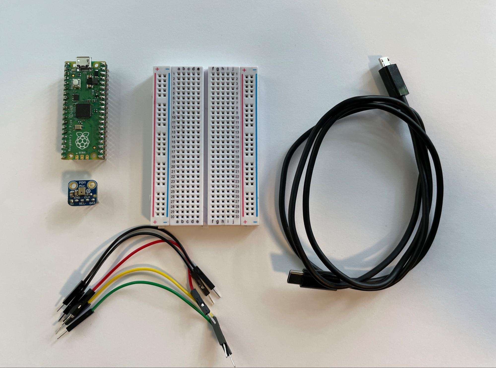

#tinyML audio classification

##Requirements
Below is a list of all the requirements you'll need to complete this project.
###a) Hardware requirements
* Raspberry Pi Pico
* Adafruit PDM MEMS Microphone Breakout
* Half size of full size breadboard
* Jumper wires
* A USB-B micro cable to connect the board to your computer
* Soldering Iron

###b) Software requirements
* [WebUSB API](https://wicg.github.io/webusb/) enabled browser like Google Chrome
* `Note for Windows` If you are using Windows you must install WinUSB drivers in order to use WebUSB, you can do
so by following the instructions found [here](https://github.com/ArmDeveloperEcosystem/ml-audio-classifier-example-for-pico/blob/main/windows.md).
* `Note for Linux` If you are using Linux you must configure udev in order to use WebUSB, you can do so by following 
the instructions found [here](https://github.com/ArmDeveloperEcosystem/ml-audio-classifier-example-for-pico/blob/main/linux.md).
* [Google Account](https://www.google.com/account/about/)
* [Google Colab](https://colab.research.google.com/notebooks/)

## 1. Create a USB Microphone with the Raspberry Pi Pico
first we would like to make sure that the RP Pico can function as a microphone.
To do this, [check out this tutorial in Hackster.io](https://www.hackster.io/sandeep-mistry/create-a-usb-microphone-with-the-raspberry-pi-pico-cc9bd5)

## 2. ML Audio classification for RP Pico notebook
We have prepared a google colab notebook where we describe the process of building the model from scratch and flashing
onto you RP Pico. Follow the steps below. (we would assume you already have a google account)
* Visit [Google Colaboratory](https://colab.research.google.com/)
* In the top left corner click `File` then `open notebook`
* click the `GitHub` tab in the new window
* Paste in this [notebook url](url.com) and click enter
* on the list of paths that appear, click the `ML_Audio_Classifier_for_Pico.ipnyb`
* You will be redirected to the notebook in colab
* Follow the steps in the notebook
